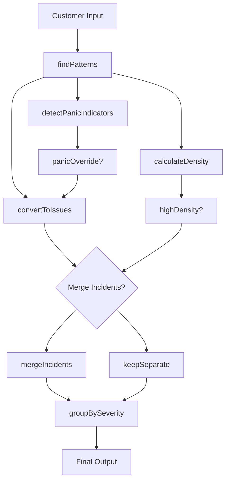

# AI System Understanding & Planning

## Current State
We've built a sophisticated AI plumbing issue detection system with these components:

### 🎯 Today's Goals
1. **Achieve concrete results** - Get working end-to-end examples
2. **Better understanding** - Visual diagrams and clear explanations
3. **Clear documentation** - Step-by-step breakdown for future reference

---

## 🧠 AI System Overview

### Input Flow
```
Customer Text → AI Detection → Issue Processing → Severity Assignment → Incident Merging → Output
```

### Core Components

#### 1. **Symptom Detection** (`lookupMaps.js`)
- Detects individual symptoms (leak, clog, pouring, etc.)
- **NEW**: Groups connected symptoms ("bubbling and sagging")
- Uses regex patterns and alias matching

#### 1.5. **Compound Location Detection** (`compoundLocationHelpers.js`)
- **NEW**: Detects area relationships with 15 prepositions
- Covers: from, in, at, above, below, under, behind, next to, near, around, through, inside, underneath, over, across
- Examples: "ceiling from bathroom", "wall behind sink", "floor under toilet"

#### 2. **Panic Detection** (`aiBasicLearner.js`)
- Detects emergency indicators in customer language
- 7 pattern categories: help requests, urgency, uncontrolled, intensity, panic words, repetition, exclamations
- Calculates panic score

#### 3. **Severity Assignment** (`aiBasicLearner.js`)
- **Clarification lane**: ambiguous, area_only, symptom_only (unless immediate)
- **Immediate overrides**: based on area-job configs
- **Panic override**: upgrades to immediate if panic + high density

#### 4. **Incident Merger** (`aiBasicLearner.js`)
- Groups multiple detections by damage area
- Merges symptoms for each area
- Attaches source locations (bathroom, kitchen)
- Uses highest severity across merged elements

#### 5. **Data Files**
- `symptoms.js`: All symptom definitions with aliases and severities
- `damagePlaces.js`: Where damage is visible (rooms, surfaces)
- `plumbingIssueItems.js`: Where plumber works (fixtures, components)
- `areaJobConfigs.js`: Area-symptom severity overrides

---

## 🔄 Step-by-Step Process

### Step 1: Text Analysis
```javascript
const matches = findPatterns(customerText)
```
- Finds all symptom and area matches
- Detects symptom groups connected by "and"

### Step 2: Panic Assessment
```javascript
const panicInfo = detectPanicIndicators(customerText)
```
- Analyzes for emergency language patterns
- Calculates panic score

### Step 3: Density Calculation
```javascript
const hasHighDensity = (symptoms >= 2 && areas >= 2) || areas >= 3
```
- Determines if this is a complex incident

### Step 4: Issue Processing
```javascript
const issues = matches.map(match => convertToIssue(match))
```
- Converts matches to issue objects
- Assigns base severity
- Applies panic override if needed

### Step 5: Incident Merging (if high density)
```javascript
const mergedIssues = hasHighDensity ? mergeIncidents(issues) : issues
```
- Groups by damage area
- Merges symptoms
- Attaches source locations
- Uses highest severity

### Step 6: Final Output
```javascript
return {
  issues: mergedIssues,
  groupedIssues: { IMMEDIATE, SAME_DAY, SCHEDULE, CLARIFICATION },
  totalIssues: mergedIssues.length
}
```

---

## 🎯 Concrete Goals for Today

### Goal 1: Working Example - Complex Incident
**Input**: "Water is pouring through the ceiling from the upstairs bathroom, the ceiling is bubbling and sagging, the wall is wet"

**Expected Output**: 
- 1 merged incident: "Ceiling from upstairs bathroom: pouring, bubbling and sagging, wall wet"
- Severity: IMMEDIATE
- All symptoms and areas consolidated

### Goal 2: Working Example - Panic Detection
**Input**: "help help emergency flooding everywhere can't stop water"

**Expected Output**:
- Panic override triggers
- Severity upgraded to IMMEDIATE
- Multiple symptoms merged into single incident

### Goal 3: Visual Understanding
- Create mermaid diagram of the flow
- Map each component to its file
- Show data transformation at each step

---

## 📊 System Diagram (Coming Next)



---

## ✅ Progress Tracking

- [x] Symptom grouping detection
- [x] Panic detection system
- [x] Incident merger logic
- [x] Clarification lane
- [x] Test cases added
- [ ] Complex incident working example
- [ ] Panic detection working example
- [ ] Complete system diagram
- [ ] Step-by-step documentation

---

## 🤔 Questions to Clarify

1. **What specific part feels most confusing?** 
   - The data flow between components?
   - How symptoms get grouped?
   - How incidents get merged?

2. **What would make you feel "fulfilled" today?**
   - Seeing a perfect complex example work?
   - Understanding each component's role?
   - Having clear documentation for future?

3. **What visualization would help most?**
   - Flow diagram of the entire process?
   - Data structure mapping?
   - File-by-file breakdown?
